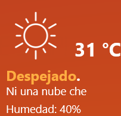

# CheClimatico para Rainmeter
Un fork de Shanee's AuthenticWeather que se corrigió para que funcione con la nueva API meteorológica, se dejan de utilizar las frases NSFW y se "argentinizó".

### Instalación:

- Descargá el archivo zip desde [Releases](https://github.com/masterofobzene/CheClimatico-Rainmeter/releases).
- Navegá a tu carpeta de skins de Rainmeter.
- **Descomprimílo allí junto con las otras skins.**
- Editá el archivo `CheClimatico.ini` y agregá tu API de OpenWeatherMap, Latitud y Longitud.
- Actualizá el skin.
- __SI LOS ACENTOS NO SE MUESTRAN DEBES GRABAR LOS .lua Y EL .ini EN FORMATO UTF-16LE CON NOTEPAD++.__

